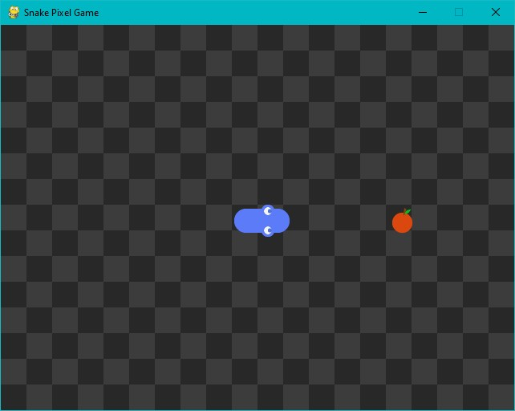
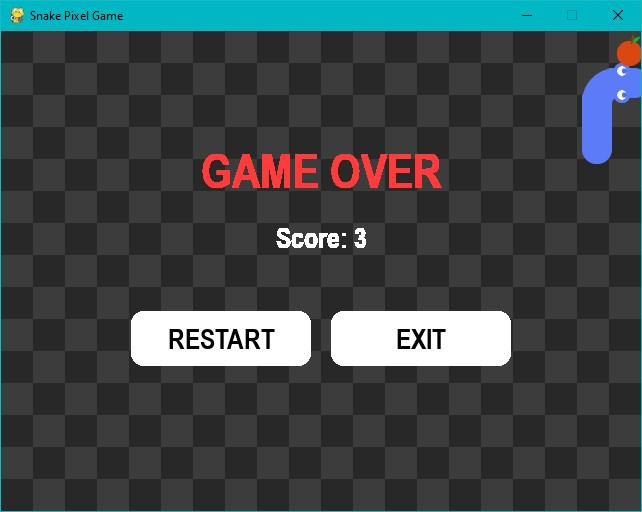

# 🐍 Snake Pixel Game

Game **Snake** bergaya pixel art dibuat dengan **Python + Pygame**.  
Ular tumbuh setiap kali memakan makanan dan mati saat menabrak dirinya sendiri.  
Tampilan game over dilengkapi tombol **Mulai Lagi** dan **Keluar** dengan efek hover interaktif 🎮

---

## Screenshot

### Gameplay
<p align="center">
  
</p>

### Game Over Screen
<p align="center">
  
</p>

---

## Cara Menjalankan

```bash
# 1. Clone repository
git clone https://github.com/elnaxy12/Snake
cd Snake

# 2. Buat & aktifkan virtual environment
python -m venv venv
venv\Scripts\activate   # Windows
# atau
source venv/bin/activate   # Mac/Linux

# 3. Install dependencies
pip install -r requirements.txt

# 4. Jalankan game
python app.py
